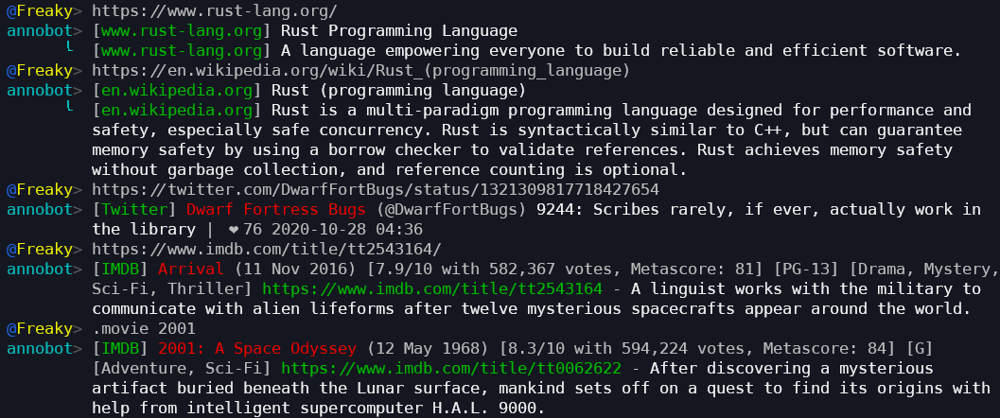

# annoirc - annotate IRC

A simple, efficient IRC bot for annotating Internet Relay Chat conversations.



## Description

`annobot` is an IRC bot meant to respond to unauthenticated users with information
to help enhance the Chat Experience™.  This includes:

* Title text and meta descriptions of websites.
* Dedicated handling for IMDB, Twitter, YouTube, and Wikipedia.
* Pretty colours.
* Other stuff at some point.

It's currently very young and should be deployed with care.

## Key Features

* Multi-network.
* Efficient async Rust with request caching and deduplication.
* Per-channel rate limits.
* Graceful config reloads via `SIGHUP`.
* Messy code.

## Usage

Create a configuration file, using `example.toml` as a guide.

Build the bot (currently requires Rust nightly):

```shell
$ cargo install --git https://github.com/Freaky/annoirc.git
```

And run it passing the path to the configuration:

```shell
$ annoirc -c config.toml
```

Changes to your configuration can be applied by calling`kill -HUP` on the annoirc
process.

Configuring it to act as a daemon is system-specific and left as an exercise.

## Todo

* General refactoring.
* Better rate limits.
* Gracefuler config reloads (any IRC changes currently involve a reconnection).
* Fully templated responses with colour support.
* Special handling for Github, Imgur, etc.
* Functions such as weather, dictionary lookups, currency conversions, stocks, etc.

## See Also

* [url-bot-rs](https://github.com/nuxeh/url-bot-rs), another simple Rust URL handling bot.